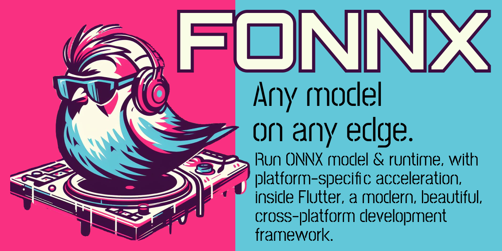

| Platform     | Status |
|--------------|--------|
| __Android__  | [](https://codemagic.io/app/652897766ee3f7af8490a79f/android-build/latest_build) |
| __iOS__  | [](https://codemagic.io/app/652897766ee3f7af8490a79f/ios-build/latest_build) |
| __Linux__    | [](https://codemagic.io/app/652897766ee3f7af8490a79f/linux-build/latest_build) |
| __macOS__ | [](https://codemagic.io/app/652897766ee3f7af8490a79f/macos-build/latest_build) |
| __Web__  | [](https://codemagic.io/app/652897766ee3f7af8490a79f/web-build/latest_build) |
| __Windows__  | [](https://codemagic.io/app/652897766ee3f7af8490a79f/windows-build/latest_build) |

# Changelog

## 2026 Aug 24
- Pronunciation transcription can preserve exact decoder token IDs, identify
  their vocabulary, decode them without re-tokenization, and feed compatible
  token sequences directly back into keyword matching.
## 2026 Aug 9
- Added runtime-configurable English keyword spotting on Android, iOS, Linux,
  macOS, Windows, and Web.
- All native targets use the same Dart FFI worker through Native Assets; no
  Kotlin, Swift, CocoaPods, Maven, or model-specific native runner is needed.
- Added runtime phrase replacement, pronunciation aliases, teach-by-voice
  transcription, streaming fixtures, and Android/iOS integration tests.
- Added the ORT 1.27.0 Apple SME Zipformer workaround. It is scoped to the
  encoder session and can be removed after upgrading the Native Asset to fixed
  ORT 1.27.1 or newer.

## 2026 Jul 20
- Upgraded ONNX Runtime from 1.16.1 to 1.27.0 on every native platform.
- Replaced vendored binaries, CocoaPods, Maven runtime dependencies, and
  Kotlin/Swift platform channels with SHA-256-verified native code assets and
  one Dart FFI inference implementation.
- Added Linux aarch64 support for Raspberry Pi/flutter-pi.
- Pinned a selected-op ONNX Runtime Extensions build for Whisper's
  `ai.onnx.contrib:BpeDecoder`; Magika and Pyannote were verified as core-ORT
  models and no longer register Extensions.
- Native support is Android armv7/arm64/x64, iOS arm64 device/simulator, Linux
  x64/aarch64, macOS arm64, and Windows x64/arm64. Intel macOS is dropped.

## 2026 Jul 19
- Upgraded voice activity detection to the official Silero VAD v6.2.1 model.
- Added the v6 streaming state/context contract on native, mobile, and web.

## 2024 Apr 22
- CI builds for all platforms are now running on Codemagic..

## 2024 Feb 26
- Google's [Magika](https://google.github.io/magika/) for file identification supported on all platforms.
- Example app including full voice assistant flow, with Whisper, Silero voice activity detection. Available at [telosnex.github.io/fonnx/](https://telosnex.github.io/fonnx/)

## 2024 Feb 19
- Whisper supported on all platforms, including web.

## 2024 Feb 13

- Whisper now supported on all platforms besides web.
- Whisper models support timestamps. (not exposed via API, yet)
- Silero VAD added to all platforms besides web.
- Silero VAD enables detecting when the user is done speaking with a much higher success rate than relying on volume levels.
- Example contains `SttService`, an example of how to integrate the VAD and Whisper together with an easy to use interface. (Stream<String>)

# FONNX

## Any model on any edge

Run ML models natively on any platform. ONNX models can be run on iOS, Android, Web, Linux, Windows, and macOS.

## What is FONNX?

FONNX is a Flutter library for running ONNX models.
Flutter, and FONNX, run natively on iOS, Android, Web, Linux, Windows, and macOS.
FONNX leverages [ONNX](https://onnx.ai/) to provide native acceleration capabilities, from CoreML on iOS, to Android Neural Networks API on Android, to WASM SIMD on Web.
Most models can be easily converted to ONNX format, including models from Pytorch, Tensorflow, and more.

## Getting ONNX Models

### Hugging Face

[🤗 Hugging Face](https://huggingface.co/models) has a large collection of models, including many that are ONNX format. 90% of the models are Pytorch, which can be converted to ONNX.

Here is a search for [ONNX models](https://huggingface.co/models?sort=trending&search=onnx).

### Export ONNX from Pytorch, Tensorflow, & more

A command-line tool called `optimum-cli` from HuggingFace converts Pytorch and Tensorflow models. This covers the vast majority of models. `optimum-cli` can also quantize models, significantly reduce model size, usually with negligible impact on accuracy.

See [official documentation](https://huggingface.co/docs/optimum/exporters/onnx/usage_guides/export_a_model) or the
quick start [snippet on GitHub](https://github.com/huggingface/optimum#run-the-exported-model-using-onnx-runtime).  
Another tool that automates conversion to ONNX is [HFOnnx](https://neuml.github.io/txtai/pipeline/train/hfonnx/). It was used to export the text embeddings models in this repo. Its advantages included a significantly smaller model size, and incorporating post-processing (pooling) into the model itself.

- Brief intro to how ONNX model format & runtime work [huggingface.com](https://huggingface.co/docs/optimum/onnxruntime/concept_guides/onnx)
- [Netron](https://netron.app/) allows you to view ONNX models, inspect their runtime graph, and export them to other formats

### Text Embeddings

These models generate embeddings for text.
An embedding is a vector of floating point numbers that represents the meaning of the text.  
Embeddings are the foundation of a vector database, as well as retrieval augmented generation - deciding which text snippets to provide in the limited context window of an LLM like GPT.

Running locally using FONNX provides significant privacy benefits, as well as latency benefits.
For example, rather than having to store the embedding and text of each chunk of a document on a server, they can be stored on-device.
Both MiniLM L6 V2 and MSMARCO MiniLM L6 V3 are both the product of the Sentence Transformers project. Their website has excellent documentation explaining, for instance, [semantic search](https://www.sbert.net/examples/applications/semantic-search/README.html)

#### MiniLM L6 V2

Trained on a billion sentence pairs from diverse sources, from Reddit to WikiAnswers to StackExchange.
MiniLM L6 V2 is well-suited for numerous tasks, from text classification to semantic search.
It is optimized for [symmetric search](https://www.sbert.net/examples/applications/semantic-search/README.html#symmetric-vs-asymmetric-semantic-search), where text is roughly of the same length and meaning.
Input text is divided into approximately 200 words, and an embedding is generated for each.  
[🤗 Hugging Face](https://huggingface.co/sentence-transformers/all-MiniLM-L6-v2)

#### MSMARCO MiniLM L6 V3

Trained on pairs of Bing search queries to web pages that contained answers for the query.
It is optimized for [asymmetric semantic search](https://www.sbert.net/examples/applications/semantic-search/README.html#symmetric-vs-asymmetric-semantic-search), matching a search query to an answer.
Additionally, it has 2x the input size of MiniLM L6 V2: it can accept up to 400 words as input for one embedding.  
[🤗 Hugging Face](https://huggingface.co/sentence-transformers/msmarco-MiniLM-L-6-v3/tree/main)

#### Benchmarks

**iPhone 14**: 67 ms  
**Pixel Fold**: 33 ms  
**macOS**: 13 ms  
**WASM SIMD**: 41 ms

Avg. ms for 1 Mini LM L6 V2 embedding / 200 words.

- Run on Thurs Oct 12th 2023.
- macOS and WASM-SIMD runs on MacBook Pro M2 Max.
- Average of 100 embeddings, after a warmup of 10.
- Input is mix of lorem ipsum text from 8 languages.

# Integrating FONNX

## Open-vocabulary keyword spotting

The 5 MB GigaSpeech Zipformer bundle detects English phrases selected at
runtime. It accepts streaming mono 16 kHz PCM, supports atomic phrase changes,
and can learn pronunciation aliases from a recording. Native targets share one
Dart FFI implementation; Web uses an ONNX Runtime worker with the same Dart
frontend and decoder.

```dart
final spotter = await KeywordSpotter.load(
  bundle: KeywordSpotterBundle.gigaSpeech3m(modelDirectory),
  keywords: const [
    KeywordPhrase('telosnex', spokenForms: ['tell us next']),
  ],
);
spotter.detections.listen((event) => print(event.phrase));
await spotter.acceptPcm16(microphoneBytes);
await spotter.close();
```

See the [keyword spotter documentation](lib/models/keyword_spotter/README.md)
and the example's realtime phrase editor.

## Native platforms via Dart FFI and code assets

Android, iOS, Linux, macOS, and Windows use the same Dart FFI implementation.
`hook/build.dart` reads the canonical `native_artifacts/manifest.json`, selects
the target artifact, downloads it into a content-addressed cache, verifies its
pinned SHA-256, extracts the library, and
emits a bundled Flutter code asset. There are no FONNX CocoaPods/Gradle native
dependencies and no platform channels.

Microsoft's published iOS artifact is static and cannot be loaded as a Dart
code asset. FONNX release CI runs Microsoft's official Apple framework script
in its supported dynamic mode and publishes arm64 device/simulator artifacts
for the hook. iOS 15.1 or newer is required. macOS 14 or newer and Apple
Silicon are required; Intel support was intentionally dropped.
The current selected-op Linux artifact requires glibc 2.38 and
`GLIBCXX_3.4.32`; Windows requires the Microsoft Visual C++ 2015–2022 runtime.
These exact floors are verified and recorded in the production manifest.

### Required iOS project setup

Set both the Runner deployment target and `platform :ios` in the Podfile to
15.1 or newer. Flutter 3.44.2's iOS native-assets pipeline generates framework
`Info.plist` files with Flutter's iOS 13 baseline. It does not currently derive
that value from a consuming Runner project's higher deployment target. The
related upstream history is [flutter/flutter#148044](https://github.com/flutter/flutter/issues/148044),
and Flutter's source TODO points to the still-open
[flutter/flutter#145104](https://github.com/flutter/flutter/issues/145104).

ORT 1.27's Apple Mach-O binaries require iOS 15.1. App Store Connect rejects a
framework that advertises a lower minimum than its binary with `ITMS-90208`.
Until Flutter propagates the app target into native-asset packaging, add a Run
Script phase immediately **after** Flutter's `Thin Binary` phase. The phase
must set `MinimumOSVersion` on `onnxruntime.framework` and
`ortextensions.framework` to `IPHONEOS_DEPLOYMENT_TARGET`, verify that this
minimum is not lower than any embedded Mach-O minimum, and re-sign the modified
frameworks. The complete fail-closed
implementation is in
[`example/ios/fix_fonnx_framework_minimum_os.sh`](example/ios/fix_fonnx_framework_minimum_os.sh),
and the example Xcode project shows the required phase ordering.

ONNX Runtime Extensions is also a separately bundled code asset. The build is
selected to the one custom operator in the current model inventory:
Whisper's `ai.onnx.contrib:BpeDecoder`.

## Web

FONNX ships a local ONNX Runtime Web 1.27.0 reference runtime in `lib/web`
(mirrored into `example/web` in this repository).
Every model Worker imports `./ort.min.mjs`; no executable CDN dependency is
used. The same version backs native and Web inference, and the package manifest
locks the JS module, Emscripten side module, Wasm, workers, deployed copies, and
supported model fixtures. Copy the required init/Worker files plus the three
`ort*` runtime files from `lib/web` into the consuming app's `web/` directory.

Run the complete package gate with:

```bash
tool/test_all.sh
```

It verifies source/artifact/model hashes, rejects Git LFS pointers, executes a
real local Web identity and Magika Worker model, runs the package-owned
finalizer through 8,192 ASan/UBSan ownership states, checks exact native
ORT/Extensions artifacts plus hydrated model goldens/RSS tests serially, and
runs the deterministic frontend corpus through VM, Chrome JavaScript, and
Chrome Wasm. Set `FONNX_FULL_RUNTIME_MATRIX=1` to include iOS Simulator,
Android, Linux arm64/x64, and Windows/Wine artifact execution.

Sending these headers with the request for the ONNX JS package gives a 10x speedup:

```
Cross-Origin-Embedder-Policy: require-corp
Cross-Origin-Opener-Policy: same-origin
```

See [this GitHub issue](https://github.com/nagadomi/nunif/issues/34) for details. TL;DR: It allows use of multiple threads by ONNX's WASM implementation by using a SharedArrayBuffer.

### Developing with Web

Serve `.wasm` as `application/wasm`. For multithreaded inference, serve both
cross-origin isolation headers shown above; ORT falls back to one thread when
`SharedArrayBuffer` is unavailable. `flutter run -d chrome` is sufficient for
single-threaded development and requires no CDN download or browser extension.

# License

FONNX is licensed under a dual-license model.

The code as-is on GitHub is licensed under GPL v2. That requires distribution of the integrating app's source code, and this is unlikely to be desirable for commercial entities. See LICENSE.md.

Commercial licenses are also available. Contact info@telosnex.com. Expect very fair terms: our intent is to charge only entities, with a launched app, making a lot of money, with FONNX as a core dependency. The base agreement is here: https://github.com/lawndoc/dual-license-templates/blob/main/pdf/Basic-Yearly.pdf
